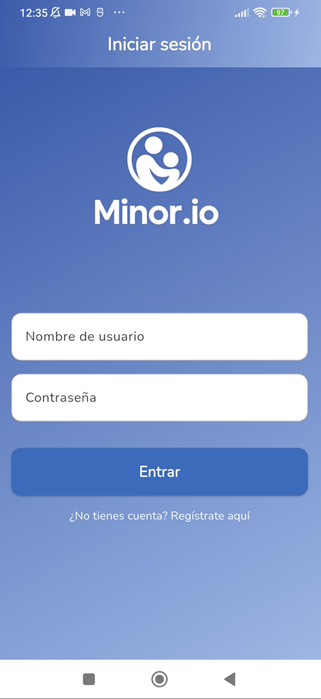
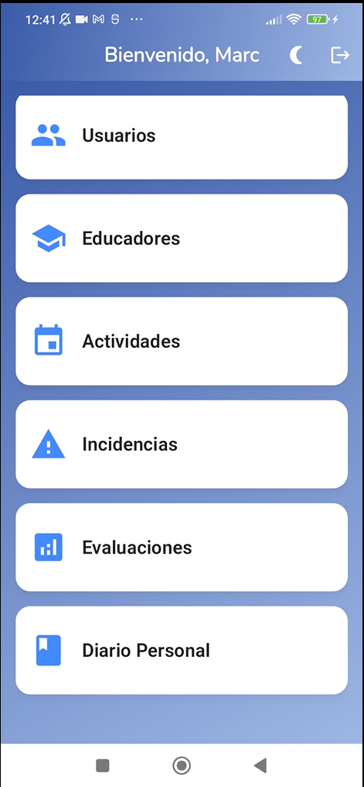
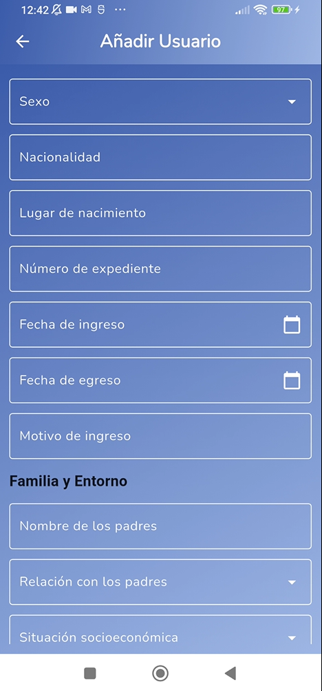
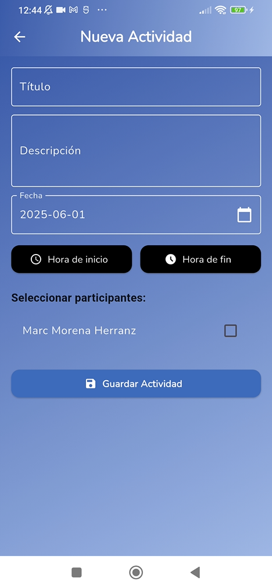
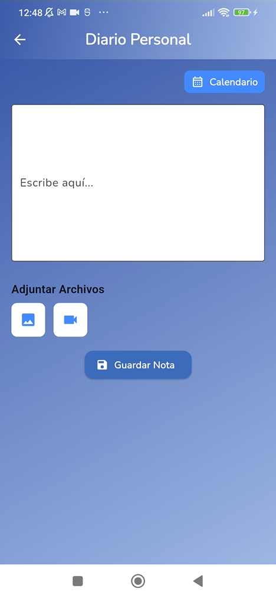
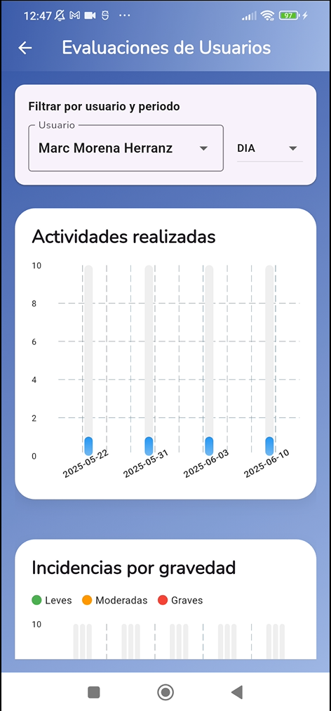

# Minor.io

**Minor.io** es una aplicación móvil multiplataforma desarrollada con **Flutter** cuyo objetivo es facilitar la gestión estructurada y eficiente de la información en **centros de menores**.  
La aplicación centraliza datos clave y procesos habituales del ámbito educativo y social, ofreciendo una herramienta clara, intuitiva y adaptada al trabajo diario de profesionales del sector.

> Proyecto de Fin de Ciclo – Desarrollo de Aplicaciones Multiplataforma (DAM)

---

## Descripción del proyecto

Minor.io nace como respuesta tecnológica a una necesidad real observada durante un período de prácticas profesionales: la dificultad de gestionar de forma organizada, trazable y segura la información relacionada con menores, educadores y actividades en centros de protección.

La aplicación permite registrar, consultar y actualizar información relevante de manera sencilla, reduciendo la carga administrativa y mejorando la coordinación entre profesionales.  
Está diseñada para integrarse de forma natural en el flujo de trabajo diario, priorizando la usabilidad, la claridad visual y la coherencia funcional.

---

## Objetivos principales

- Centralizar la información de menores y profesionales en una única aplicación.
- Facilitar el seguimiento del historial, actividades, incidencias y evaluaciones.
- Ofrecer una experiencia de usuario intuitiva y profesional.
- Garantizar la organización, trazabilidad e integridad de los datos.
- Diseñar una arquitectura preparada para futuras ampliaciones.

---

## Arquitectura y enfoque técnico

- **Aplicación móvil multiplataforma** desarrollada con Flutter.
- **Arquitectura modular**, con secciones independientes para facilitar mantenimiento y escalabilidad.
- **Gestión de estado** mediante `Provider`, seleccionada por su simplicidad y eficiencia.
- Persistencia de datos local mediante **Hive** y **SharedPreferences**.
- Desarrollo orientado a buenas prácticas y código legible.

Se ha priorizado una arquitectura clara y comprensible, evitando soluciones innecesariamente complejas dada la escala del proyecto, sin comprometer la calidad del código.

---

## Funcionalidades principales

### Autenticación
- Registro de usuarios.
- Inicio de sesión seguro.
- Control de acceso según usuario.

### Gestión de menores (Usuarios)
- Alta, consulta y eliminación de usuarios.
- Clasificación por rangos de edad.
- Gestión estructurada de información personal y administrativa.

### Gestión de educadores
- Registro y consulta de profesionales.
- Asociación de información relevante al contexto del centro.

### Actividades
- Registro y seguimiento de actividades realizadas.
- Organización clara y accesible.

### Incidencias
- Registro de incidencias.
- Clasificación y consulta por tipo o gravedad.

### Evaluaciones
- Indicadores de seguimiento.
- Visualización clara de datos de evolución.
- Lógica modular para futuras ampliaciones analíticas.

### Diario personal
- Registro de anotaciones diarias.
- Seguimiento continuo del menor.

---

## Pruebas y validación

- Pruebas funcionales manuales continuas.
- Validación constante en **dispositivo Android físico**.
- Corrección temprana de errores y ajustes de usabilidad.
- Mejora progresiva de la experiencia de usuario (UI/UX).

El ciclo de trabajo aplicado fue:
> **Desarrollo → Commit → Prueba en dispositivo**

---

## Tecnologías utilizadas

- **Flutter**
- **Dart**
- **Provider** (gestión de estado)
- **Hive** (persistencia local)
- **SharedPreferences**
- **Git & GitHub**
- **Visual Studio Code**

---

## Buenas prácticas aplicadas

- Código modular y reutilizable.
- Uso de widgets personalizados.
- Convenciones oficiales de Flutter y Dart.
- Validaciones en formularios y control de errores.
- Commits frecuentes y descriptivos.
- Organización clara del proyecto y estructura de carpetas.

---

## Posibles mejoras futuras

- Autenticación biométrica (huella / reconocimiento facial).
- Cifrado de datos locales.
- Migración a base de datos relacional (SQLite).
- Refactorización hacia Clean Architecture.
- Incorporación de pruebas automatizadas.
- Manual de usuario y modo demostración.

---

## Capturas de pantalla

## Autor

**Marc Morena Herranz**  
Desarrollador de Aplicaciones Multiplataforma  

- GitHub: https://github.com/marcmorena
- Proyecto académico – DAM (2024/2025)

---

## Licencia

Proyecto desarrollado con fines académicos y demostrativos.  
Uso educativo y técnico.
